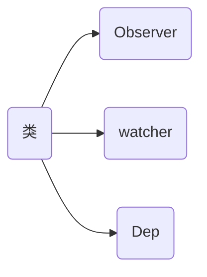

## 对vue的理解


Vue所关注的核心是MVC模式中的视图层，同时，它也能方便地获取数据更新，并通过组件内部特定的方法实现视图与模型的交互

MVVM表示的是 `Model-View-ViewModel`
Model：模型层，负责处理业务逻辑以及和服务器端进行交互
View：视图层：负责将数据模型转化为UI展示出来，可以简单的理解为HTML页面
ViewModel：视图模型层，用来连接Model和View，是Model和View之间的通信桥梁

## VUE2的响应式

**原理**：当把一个普通的 JS 对象传入 Vue 实例作为 `data` 返回，Vue 将遍历此对象所有的属性，使用 `Object.defineProperty` 把这些属性全部转为访问器属性（getter/setter）。

每个组件实例都对应一个观察者 `watcher` 实例，它会在组件渲染的过程中把“接触”过的数据属性记录为依赖`Dep`。之后当依赖项的 setter 触发时，会通知 watcher，从而使它关联的组件重新渲染。

流程：
1. Data通过observer转换成了getter/setter的形式来追踪变化。
2. 当外界通过Watcher读取数据时，会触发getter从而将Watcher添加到依赖中Dep。
3. 当数据发生了变化时，会触发setter，从而向Dep中的依赖（即Watcher）发送通知。
4. Watcher接收到通知后，会向外界发送通知，变化通知到外界后可能会触发视图更新，也有可能触发用户的某个回调函数等。

Vue2响应式缺点：
vue2仅仅只能观测到object数据的取值及设置值，当我们向object数据里添加一对新的key/value或删除一对已有的key/value时，它是无法观测到的，导致当我们对object数据添加或删除值时，无法通知依赖，无法驱动视图进行响应式更新。

### 相关代码说明
```javascript
class Observer {
    constructor(value) {
        this.value = value
        if (!value || (typeof value !== 'object')) {
            return
        } else {
            this.walk(value)
        }
    }
    walk(obj) {
        Object.keys(obj).forEach(key => {
            defineReactive(obj, key, obj[key])
        })
    }
}
```





```javascript
class Observer {
    constructor(value) {
        this.value = value
        if (!value || (typeof value !== 'object')) {
            return
        } else {
            this.walk(value)
        }
    }
    walk(obj) {
        Object.keys(obj).forEach(key => {
            defineReactive(obj, key, obj[key])
        })
    }
}
// Dep，存放watcher对象
class Dep {
    constructor() {
        this.subs = []
    }
    /*添加一个观察者对象*/
    addSub (sub) {
        this.subs.push(sub)
    }
    /*依赖收集，当存在Dep.target的时候添加观察者对象*/
    depend() {
        if (Dep.target) {
            Dep.target.addDep(this)
        }
    }
    // 通知所有watcher对象更新视图
    notify () {
        this.subs.forEach((sub) => {
            sub.update()
        })
    }
}
class Watcher {
    constructor() {
        /* 在new一个Watcher对象时将该对象赋值给Dep.target，在get中会用到 */
        Dep.target = this;
    }
    update () {
        console.log('视图更新啦')
    }
    /*添加一个依赖关系到Deps集合中*/
    addDep (dep) {
        dep.addSub(this)
    }
}
function defineReactive (obj, key, val) {
    const dep = new Dep()
    Object.defineProperty(obj, key, {
        enumerable: true,
        configurable: true,
        get: function reactiveGetter () {
            dep.depend() /*进行依赖收集*/
            return val
        },
        set: function reactiveSetter (newVal) {
            if (newVal === val) return
            dep.notify()
        }
    })
}
class Vue {
    constructor (options) {
        this._data = options.data
        new Observer(this._data) // 所有data变成可观察的
        new Watcher() // 创建一个观察者实例
        console.log('render~', this._data.test)
    }
}
let o = new Vue({
    data: {
        test: 'hello vue.'
    }
})
o._data.test = 'hello mvvm!'

Dep.target = null
```


## 为什么data以函数方式返回？

组件是可复用的`vue`实例，一个组件被创建好之后，就可能被用在各个地方，而组件不管被复用了多少次，组件中的`data`数据都应该是相互隔离，互不影响的。所以组件每复用一次，`data`数据就应该被复制一次，之后，当某一处复用的地方组件内`data`数据被改变时，其他复用地方组件的`data`数据不受影响。

>对象的浅拷贝和深拷贝

## 说一下vue的修饰符

```
参考 https://juejin.cn/post/6981628129089421326
```

## VUE2：生命周期和钩子函数
<span></span>

| 生命周期      | 描述                               |
| ------------- | ---------------------------------- |
| beforeCreate  | 组件实例被创建之初                 |
| created       | 组件实例已经完全创建               |
| beforeMount   | 组件挂载之前                       |
| mounted       | 组件挂载到实例上去之后             |
| beforeUpdate  | 组件数据发生变化，更新之前         |
| updated       | 数据数据更新之后                   |
| beforeDestroy | 组件实例销毁之前                   |
| destroyed     | 组件实例销毁之后                   |
| activated     | keep-alive 缓存的组件激活时        |
| deactivated   | keep-alive 缓存的组件停用时调用    |
| errorCaptured | 捕获一个来自子孙组件的错误时被调用 |

生命周期钩子的 `this` 上下文指向调用它的当前活动实例

详解：

1. `new Vue()`实例化一个vue实例，然后init初始化event 和 lifecycle。

   其实这个过程中分别调用了3个初始化函数（`initLifecycle()`,` initEvents()`, `initRender()`），分别初始化了生命周期，事件以及定义createElement函数，初始化生命周期时，定义了一些属性，比如表示当前状态生命周期状态的isMounted ，isDestroyed ，isBeingDestroyed，表示keep-alive中组件状态的inactive，而初始化event时，实际上就是定义了once、off、emit、on几个函数。而createElement函数是在初始化render时定义的（调用了initRender函数）

2. 执行`beforeCreate`生命周期函数
   beforeCreate执行完后，会开始进行`数据初始化`，这个过程，会定义data数据，方法以及事件，并且完成<u>数据劫持observe</u>以及给组件实例配置watcher观察者实例。这样，后续当数据发生变化时，才能感知到数据的变化并完成页面的渲染

3. 执行`created`生命周期函数，所以，当这个函数执行的时候，我们已经可以拿到data下的数据以及methods下的方法了，所以在这里，我们可以开始调用方法进行数据请求了
   created执行完后，判断当前是否有`el参数`:

   - 如果有，我们再看是否有template参数。
   - 如果没有el，那么我们会等待调用mount(el)方法。

   确保有了el后，继续往下走，判断当是否有`template`参数，

   - Y : <u>将template模板转换成`render函数`</u>（其实在这前面是还有一个判断的，判断当前是否有render函数，如果有的话，则会直接去渲染当前的render函数，如果没有那么我们才开始去查找是否有template模板）
   - N：如果没有template，那么我们就会直接将获取到的<u>`el`编译成templae</u>, (el 也就是我们常见的#app，#app里面可能还会有其他标签）然后在将<u>这个template转换成`render函数`</u>。

4. 之后再调用`beforMount`， 也就是说实际从creted到beforeMount之间，最主要的工作就是将**模板或者el转换为render函数**。并且我们可以看出一点，就是不管是用el，还是用template, 或者是用我们最常用的.vue文件(如果是.vue文件，他其实是会先编译成为template)，最终他都是会被转换为render函数的。

   - 渲染render函数

     beforeMount调用后，开始渲染render函数，首先我们会先生产一个`虚拟DOM`（用于后续数据发生变化时，新老虚拟dom对比计算），进行保存，然后再开始将render渲染成为真实的dom。渲染成真实dom后，会将渲染出来的真实dom替换掉原来的vm.el（这一步我们可能不理解，请耐心往下看，后面我会举例说明)，然后再将替换后的`el` 添加到我们的页面内。整个初步流程就算是走完了

5. 之后再调用`mounted`，并将标识生命周期的一个属性 isMounted 置为true。所以<u>mounted函数内，我们是可以操作dom的</u>，因为这个时候dom已经渲染完成了。

6. 再之后，只有当我们状态数据发生变化时,我们在触发`beforeUpdate`，要开始将我们变化后的数据渲染到页面上了（实际上这里是有个判断的，判断当前的`isMounted`是不是为ture并且`isDestroyed`是不是为false，也就是说，**保证dom已经被挂载的情况下，且当前组件并未被销毁，才会走update流程**
   `beforeUpdate`调用之后，我们又会重新生成一个新的虚拟dom(Vnode)，然后会拿这个最新的Vnode和原来的Vnode去做一个diff算，这里就涉及到一系列的计算，算出最小的更新范围，从而更新render函数中的最新数据，再将更新后的render函数渲染成真实dom。也就完成了我们的数据更新

7. 然后再执行`updated`，所以updated里面也<u>可以操作dom</u>，并拿到最新更新后的dom。不过这里我要插一句话了，<u>mouted和updated的执行，并不会等待所有子组件都被挂载完成后再执行</u>，所以如果你希望所有视图都更新完毕后再做些什么事情，那么你最好在mouted或者updated中加一个nextTick()，然后把要做的事情放在netTick()中去做（至于为什么，以后讲到$nextTick再说吧）

8. 再之后`beforeDestroy`，实例销毁前，也就是说在这个函数内，你还是可以操作实例的之后会做一系列的销毁动作，解除各种数据引用，移除事件监听，删除组件watcher，删除子实例，删除自身self等。同时将实例属性_isDestroyed置为true

9. 销毁完成后，再执行`destroyed`

## 父子组件通信(组件间通信)方法

### slot传递属性

### property传递值

### emit子向父传递事件，父通知子执行事件，

### 全局


## Mounted 在父子有顺序吗？

## 路由

为什么可以实现路由跳转？

跟后端服务器进行交互的一种方式，通过不同的路径，来请求不同的资源，请求不同的页面是路由的其中一种功能。

### hash模式

localhost：8080/

`localhost：8080#/home`

比如这个 URL：http://www.abc.com/#/hello，hash 的值为 `#/hello`。

**特点**：hash 虽然出现在 URL 中，但不会被包括在 HTTP 请求中，对后端完全没有影响，因此改变 hash 不会重新加载页面，用户体验流畅

```html
<script>
  //跳转到 #/
  //监听 hashchange 事件
 window.onhashchange = (e) => {
        console.log('old:', e.oldURL);
        console.log('new:', e.newURL);
        console.log('hash', location.hash);
  }
</script>
```

方式：

- 地址栏直接改变

- 浏览器前进/后退按钮

原理：监听hash 值的变化，重新渲染视图

### history模式

mode:'history'

`localhost：8080/home`

原理： 使用pushState() 和 replaceState() 方法

```html
<script>
    const myBtn = document.querySelector('.btn');
    window.addEventListener('DOMContentLoaded',()=>{
        console.log('path:',location.pathname);
    })
  //实现 点击按钮跳转到 /user
    myBtn.addEventListener('click',()=>{
        const state = {name:'user'}
        history.pushState(state,'','user');
        console.log('切换路由到user');
    })
</script>
```

区别：

一般场景下，hash 和 history 都可以。

路由的 history 模式，这种模式充分利用 history.pushState API 来完成URL 跳转而无须重新加载页面。

另外，调用 history.pushState() 相比于直接修改 hash，存在以下优势：

- pushState() 设置的新 URL 可以是与当前 URL 同源的任意 URL；而 hash 只可修改 # 后面的部分，因此只能设置与当前 URL 同文档的 URL；
- pushState() 设置的新 URL 可以与当前 URL 一模一样，这样也会把记录添加到栈中；而 hash 设置的新值必须与原来不一样才会触发动作将记录添加到栈中；
- pushState() 通过 stateObject 参数可以添加任意类型的数据到记录中；而 hash 只可添加短字符串；
- pushState() 可额外设置 title 属性供后续使用。

缺点

- hash 模式下，仅 hash 符号之前的内容会被包含在请求中，如 http://www.abc.com，因此对于后端来说，即使没有做到对路由的全覆盖，也不会返回 404 错误。
- history 模式下，前端的 URL 必须和实际向后端发起请求的 URL 一致，如 http://www.abc.com/book/id。如果后端缺少对 /book/id 的路由处理，将返回 404 错误。


