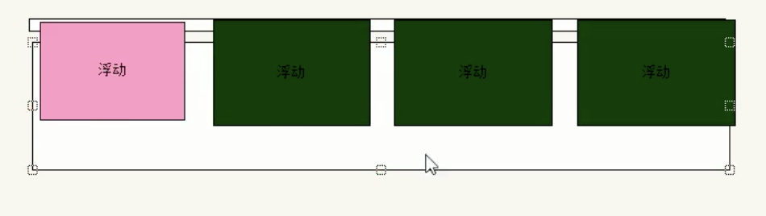
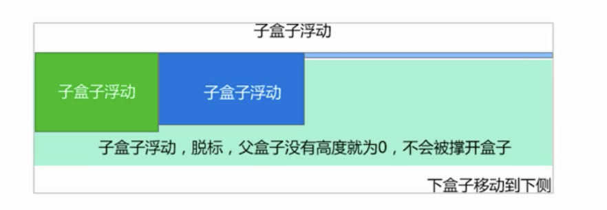

[TOC]

## 盒模型

当对一个文档进行布局（layout）的时候，浏览器的渲染引擎会根据标准之一的 CSS 基础框盒模型（CSS basic box model），将所有元素表示为一个个矩形的盒子（box）。CSS 决定这些盒子的大小、位置以及属性（例如颜色、背景、边框尺寸…）。

由外到里分别是：

`margin`：外边框，盒子模型之间的距离

`border`

`padding`：内间距，border到content的距离

`content`

盒子宽高的计算方式会根据盒子的类型而不同，盒子的类型通过 `box-sizing `设置

| 类型                       | 盒子尺寸计算 |                        |
| -------------------------- | ------------ | ---------------------- |
| `box-sizing ：content-box` |              | width 为 content的大小 |
| `box-sizing : border-box`  |              | width 为整个盒子的大小 |

## 布局模式/布局

[MDN 分类](https://developer.mozilla.org/zh-CN/docs/Learn/CSS/CSS_layout/Introduction)

- 正常布局流
- 弹性盒（flex）
- 网格布局（gird）
- 浮动（float）
- 定位（position）
- 多列布局响应式

## 正常布局流

浏览器默认html布局方式

一个块级元素的内容宽度是其父元素的100%，其高度与其内容高度一致。

内联元素的height width与内容一致。无法设置内联元素的height width。 如果想控制内联元素的尺寸，需要为元素设置`display: block`;

块级元素和内联元素

- 行内元素/内联元素：在一行文本内生成元素框，不打断所在的行。如em、
- 块级元素：（默认）生成一个填满父级元素内容区域的框，旁边不能有其他元素。如a、body、p、

注意：

- html 中行内元素可以放在块级元素内，反之不行

- css 没有限制，行内元素设置为 block 就会显示为块级元素

```css
display：inline；//行内
display：block；//块级
```

## 弹性盒/flex/响应布局

弹性盒子布局主要适用于应用程序的组件及小规模的布局，而（新兴的）栅格布局则针对大规模的布局。

### 创建 flex 容器

```css
display:flex/inline-flex
```

设置为 flex 布局之后，子元素的`float`、`clear`和`vertical-align`属性将失效。

主轴和交叉轴垂直

### 容器属性

| 容器属性          | 含义                                                         | 值**（默认）**                                               | 示例                                                         |
| ----------------- | ------------------------------------------------------------ | ------------------------------------------------------------ | ------------------------------------------------------------ |
| `flex-direction`  | 设置主轴方向，row 为起始左终止右                             | column-reverse \| column \| **row** \| row-reverse           |  |
| `flex-wrap`       | 如果一条轴线排不下，如何换行                                 | **nowrap** \| wrap \| wrap-reverse                           |  |
| `flex-flow`       | flex-direction属性和flex-wrap属性的简写形式                  | **row nowrap**                                               |                                                              |
| `justify-content` | 项目在主轴上的对齐方式                                       | **flex-start** \| flex-end \| center \| space-between \| space-around |  |
| `align-items`     | 在交叉轴上如何对齐                                           | flex-start \| flex-end \| center \| baseline \| **stretch**  |  |
| `align-content`   | 定义了多根轴线的对齐方式。如果项目只有一根轴线，该属性不起作用 | flex-start \| flex-end \| center \| space-between \| space-around \| **stretch** |  |

子元素属性

| 属性          | 说明                                                         | 值**（默认）**                                               | 示例                                                         |
| ------------- | ------------------------------------------------------------ | ------------------------------------------------------------ | ------------------------------------------------------------ |
| `order`       | 项目的排列顺序                                               |                                                              |  |
| `flex-grow`   | 属性定义项目的放大比例                                       | **0**                                                        |  |
| `flex-shrink` | 定义了项目的缩小比例,负值对该属性无效                        | **1**                                                        |                                                              |
| `flex-basis`  | 在分配多余空间之前，项目占据的主轴空间                       | **auto**                                                     |                                                              |
| `flex`        | Flex-grow flex-shrink flex-basis 的简写                      |                                                              |                                                              |
| `align-self`  | 允许单个项目有与其他项目不一样的对齐方式，可覆盖align-items属性 | **auto** \| flex-start \| flex-end \| center \| baseline \| stretch; |                                                              |

[2分钟掌握 CSS flexbox 布局](https://www.bilibili.com/video/BV1P7411m7Nu)

## 栅格布局

[MDN](https://developer.mozilla.org/zh-CN/docs/Web/CSS/CSS_Grid_Layout)

[术语](https://www.w3school.com.cn/css/css_grid.asp)

```css
display:grid
display:inline-grid
```

### 相关属性

**调整间隙大小**

- `grid-column-gap` 列
- `grid-row-gap` 行
- `grid-gap` 指定两个参数时为分别赋予行、列，指定一个参数时行列赋予同一个值

**指定行列与分区**

显示网格和隐式网格：

在容器div上用 row和column定义的网格总数，等于 行数乘以列数 个。比如一个容器div定义了2行*3列=6个网格，这6个就是显式网格，但是假如里面有8个 子div，多出来那2个就叫做隐式网格

- 显示网格属性`grid-template-columns`指定列宽，定义网格线的名称和网格轨道的尺寸大小

- 显示网格属性`grid-template-rows`指定行高，定义网格线的名称和网格轨道的尺寸大小

  ```css
  grid-template-columns: repeat(3,1*fr*);  3列 
  ```

- 显示网格属性`grid-template`行、列的简写

  指定名称的话需要配合 grid-area 先给class 赋值

  ```css
  grid-template:{
        "d1 d2 d2" 
        "d1 d3 d3";
    }
  .d1{
          grid-area:d1;
  }
  .d2{
   		 grid-area: d2;
  }
  .d3{
    		grid-area: d3;
  }
  ```

- 显示网格属性`grid-template-areas`

  - 配合`grid-area`生效和` grid-template`一部分效果一样

  - 在单元格里指定起始行/起始列/结束行/结束列

    ```css
    .d1{
                grid-area: 1 / 1 / 3 / 3;
    }一行两列，d1 占一整行
    ```

- 隐式网格属性`grid-auto-columns` 指定了隐式创建的网格纵向轨道的宽度，当不指定 grid-template-colums 的时候这个属性就会生效

- 隐式网格属性`grid-auto-rows`

- 隐式网格属性`grid-auto-flow `控制着自动布局算法怎样运作 :

  - row：指定自动布局按照逐行填充排列元素，必要时增加新行
  - column：指定自动布局按照逐列填充排列元素，必要时增加新列
  - dense：稠密堆积，如果后面出现稍小的元素会试图图填补之前的空白，次序可能会被打乱，可以搭配 row、column 使用

- `grid`简写属性

- `grid-row`简写（grid-row-start、grid-row-end)如果指定了两个值，那么斜杠号前的值就被指定为 `grid-row-start`，斜杠后面的值就被指定为 `grid-row-end` 的值。

- `grid-column`简写（grid-column-start、grid-column-end)

**对齐**

- `justify-content`在容器内水平对齐整个网格
- `align-content`垂直对齐

单位 `fr` 来定义网格轨道大小的弹性系数，浮动宽度

`repeat()`表示网格轨道的重复部分，以一种更简洁的方式去表示大量而且重复列的表达式。

## 浮动

为什么需要浮动？

- 完成标准流无法完成的布局

- `display:inline-block`盒子之间会出现缝隙

典型应用：可以让多个块级元素一行内排列显示

<span style="color:red">纵向排列--标准流，横向排列--浮动</span>

1. 浮动和标准流的父盒子搭配

先用标准流的父元素排列上下位置，之后内部子元素采取浮动排列左右位置

2. 一个元素浮动了，理论上其余兄弟元素也要浮动

浮动的盒子只会影响盒子后面的标准流不会影响前面的标准流

应用场景：文字包围图片、首字符下沉、多列布局

### 父元素高度塌陷

场景：包含浮动子元素的父元素高度会变成 1，解决：

```css
.father:after{
    content:"";
    display:block;
    clear:both;
}
```

### 浮动

问题：

父元素不方便给高度，子元素全部浮动时，父元素高度为 0，下面再给个标准流的盒子时，就会接在父元素下面被压在浮动的子元素下面，（理应是接着子元素的）

父元素有高度时不需要清除浮动





### 清除浮动方法：

1. 额外标签法

在最后一个浮动的子元素后面额外建立标签，添加清除浮动样式（不常用）

**新增的盒子必须是块级元素**

`clear : none/left/right/both`

```html
.clear{
	clear:both
}
<div Class="clear"></div>
```

2. 父级添加 overflow

`  overflow:hidden/auto/scroll;`

```html
.parent{
  overflow:hidden;
}
```

代码简洁但是无法显示溢出的部分

3. after 伪元素

父元素添加伪元素，额外标签法的升级版

```html
.clearfix:after{
	content:"";
	display:block;
	height:0;
	clear:both;
	visibility:hidden;
}
<div class = "box clearfix">
</div>
```

4. 双伪元素

```html
.clearfix:before,
.clearfix:after:{
	content:"";
	display:table;
}
<div class = "box clearfix">
</div>
```

## 定位

- 相对定位`position: relative`：能够把一个正常布局流(normal flow)中的元素**相对于它的默认位置**按坐标进行相对移动。

- 绝对定位`position: absolute`：用于将元素移出正常布局流(normal flow)，以坐标的形式**相对于它的容器**定位到web页面的任何位置。与页面布局的其余部分完全分离。
- 固定定位`position: fixed`将元素从文档流(document flow)当中移出了。相对于视口(viewport)边框定位。
- 粘性定位`position: sticky`，它会在正常布局流中滚动，直到它出现在了我们给它设定的相对于容器的位置，这时候它就会停止随滚动移动。

## 多列布局

```css
column-count:N;			 指定列数
column-width: xxxpx;	更改宽度
column-gap: xxxpx;	改变列间间隙。
column-rule:4px dotted rgb(79, 185, 227); 			在列间加入一条分割线。
```

`break-inside`设置是否在指定元素中插入分页符、分列、分区

`page-break-inside`设置是否在指定元素中插入分页符

## 响应式设计

指一个网站能够兼容多个终端——而不是为每个终端做一个特定的版本。这个概念是为解决移动互联网浏览而诞生的。

一个响应浏览环境的网页或者应用设计。它涵盖了很多CSS和HTML的功能和技术，现在基本上就是我们默认建设网站的方式。

### 响应式图像

解决问题，一张图片在不同宽度的视口下的呈现

解决方法：

1.  美术问题：剪裁
2. 分辨率切换问题：改变呈现图片的分辨率

分辨率切换：不同的尺寸

```html

```

`srcset`="文件名 图像固有宽度"

`size`="媒体条件 图像将填充的槽的宽度"

### 响应式排版

`rem`

`vw` 相对于视口的缩放

媒体查询

```css
@media(min-width:1200px){
  
}
```

视口元标签 meta

```html
<meta name="viewport" content="width=device-width,initial-scale=1">
```

这个元标签告诉移动端浏览器，它们应该将视口宽度设定为设备的宽度，将文档放大到其预期大小的100%，在移动端以你所希望的为移动优化的大小展示文档。

