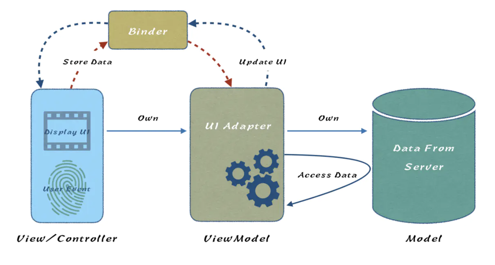

### MVC

一种设计模式，前后端都有
- Model（模型） ：模型代表一个存取数据的对象。
- View（视图）：视图代表模型包含的数据的可视化。用户所见界面。
- Controller（控制器） ： 控制器作用于模型和视图上。它控制数据流向模型对象，并在数据变化时更新视图。它使视图与模型分离开。

举例：

Model：js 变量

view：html，css

controller：通过 DOM 对象绑定事件处理函数，将变量进行修改

随着业务越来越复杂，视图交互越复杂，导致Controller越来越臃肿。由此出现了MVVM。

### MVVM

vue使用的设计模式

视图和数据通过 Vue 进行绑定，视图数据改变 model 的数据也相应改变，反之亦然

`View`和`Contrller`都放在了View层（相当于把Controller一部分逻辑抽离了出来），Model层依然是服务端返回的数据模型。而`ViewModel`充当了一个UI适配器的角色，也就是说View中每个UI元素都应该在ViewModel找到与之对应的属性。除此之外，从`Controller`抽离出来的与UI有关的逻辑都放在了ViewModel中，这样就减轻了Controller的负担。

- View层：视图展示。包含UIView以及UIViewController，View层是可以持有ViewModel的。

- ViewModel层：视图适配器。暴露属性与View元素显示内容或者元素状态一一对应。

- Model层：数据模型与持久化抽象模型。数据模型很好理解，就是从服务器拉回来的JSON数据。而持久化抽象模型暂时放在Model层，是因为MVVM诞生之初就没有对这块进行很细致的描述。按照经验，我们通常把数据库、文件操作封装成Model，并对外提供操作接口。（有些公司把数据存取操作单拎出来一层，称之为**DataAdapter层**，所以在业内会有很多MVVM的变种，但其本质上都是MVVM）。

- Binder：MVVM的灵魂。可惜在MVVM这几个英文单词中并没有它的一席之地，它的最主要作用是在View和ViewModel之间做了双向数据绑定。如果MVVM没有Binder，那么它与MVC的差异不是很大。

