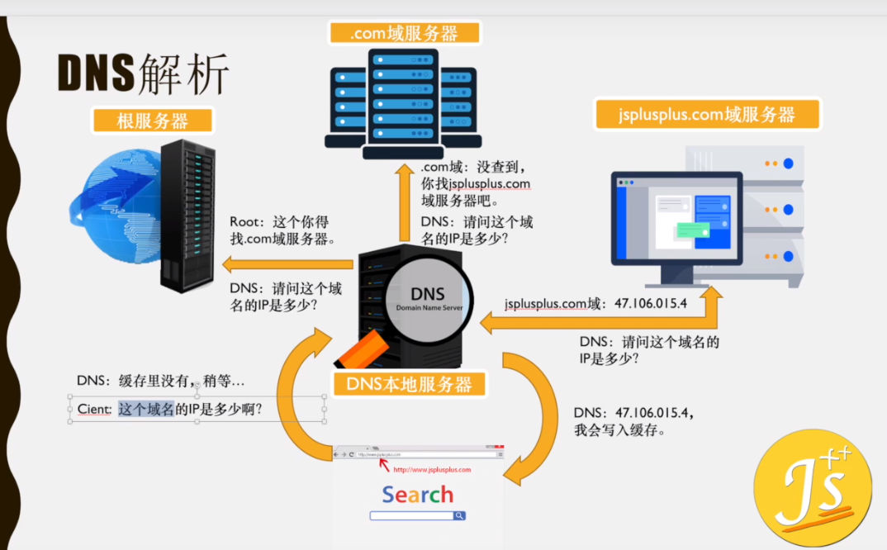
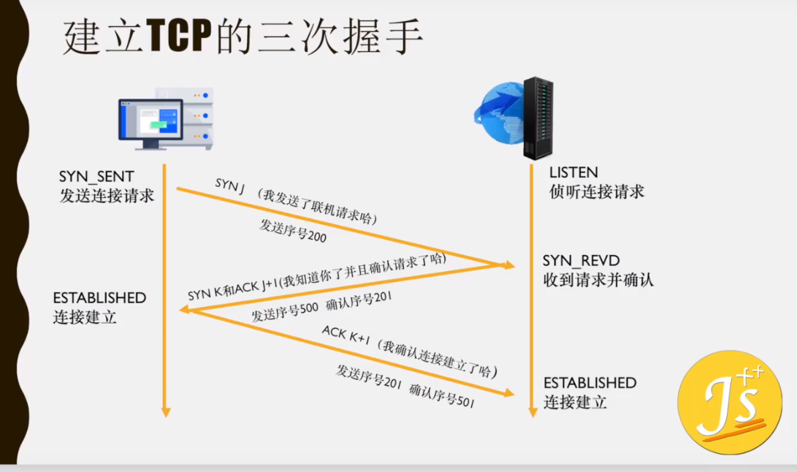

[TOC]

协议：规则

### 域名（DNS，Domain Name System）

域名是逻辑概念，只是方便人们记忆才出现的

#### 域名分类

`域名`由两组或两组以上的ASCII或各国语言字符构成，各组字符间由点号分隔开，最右边的字符组称为顶级域名或`一级域名/顶级域名`、倒数第二组称为`二级域名`、倒数第三组称为``三级域名``、以此类推

一级域名：负责管理在该顶级域名服务器注册的所有二级域名。

`顶级域名`又分为三类：

- 国家和地区顶级域名（country code top-level domains，简称ccTLDs ），目前200多个国家都按照ISO3166国家代码分配了顶级域名，例如中国是cn，日本是jp等；

- 通用顶级域名（generic top-level domains，简称**gTLDs**），例如表示工商企业的.com，表示网络提供商的 .net，表示非盈利组织的 .org等。

- 新顶级域名（New gTLD）如通用的.xyz、代表“高端”的.top、代表“红色”的.red、代表“人”的.men等一千多种。

#### 域名解析

**域名解析**是把域名指向网站空间IP，让人们通过注册的域名可以方便地访问到网站的一种服务。

**域名解析**就是域名到IP地址的转换过程。域名的解析工作由**DNS服务器**完成。

DNS 服务器为一个联机分布式数据库系统

- 作用：将域名与对应的 Ip转换的**服务器**
- 特征：DNS 中保存了一张域名与对应 IP 地址的表

​			一个域名对应一个IP 地址，一个 IP 地址可以对应多个域名

- gTLD（generic top-level domains）：==.com==、==.net==

  

  
  
  
  
  
  
  <div align="center">  </div><br> 

> **根服务器**：管理互联网的主目录，1 个主根在美国，12 个辅根:9 个在美国，2 个在欧洲（英国&瑞典），一个在日本

##### DNS 解析（3-10）、Http解析流程（1-10）

当一个用户`m.xyz.com`在地址栏输入`y.abc.com`时，DNS解析有大致十个过程

<span style="color:grey">1. **浏览器**先检查自身缓存中有没有被解析过的这个域名对应的ip地址，如果有，解析结束。同时域名被缓存的时间也可通过TTL属性（Time To Live，生存时间值，该字段指定IP包被路由器丢弃之前允许通过的最大网段数量）来设置。</span>

<span style="color:grey">2. 如果浏览器缓存中没有（专业点叫还没命中），浏览器会检查**操作系统缓存**中有没有对应的已解析过的结果。而操作系统也有一个域名解析的过程。在windows中可通过c盘里一个叫hosts的文件来设置，如果你在这里指定了一个域名对应的ip地址，那浏览器会首先使用这个ip地址。</span>

3. 如果至此还没有命中域名，才会真正的请求**本地域名服务器（LDNS）**`dns.xyz.com`来解析这个域名，这台服务器一般在你的城市的某个角落，距离你不会很远，并且这台服务器的性能都很好，一般都会缓存域名解析结果，大约80%的域名解析到这里就完成了。
4. 如果LDNS仍然没有命中，就把请求发给 13 台**根域名服务器**（``.``）请求解析
5. 根域名服务器判断这个域名（.com）是由谁授权管理，返回给LDNS一个所查询域的**顶级服务器gTLD**(`dns.com/.net`)IP。
6. LDNS再发送请求给上一步返回的**顶级域名服务器**
7. 接受请求的顶级域名服务器查找，并返回这个域名对应的权限DNS 服务器地址 (`dns.abc.com`)
8. 权限 DNS 服务器根据**映射关系表**找到目标IP，返回给LDNS
9. LDNS缓存这个域名和对应的IP
10. LDNS把解析的结果返回给用户，用户根据TTL值缓存到本地系统缓存中，域名解析过程至此结束

### IP地址/互联网协议地址（Internet Protocol Adress）

- 作用：分配给用户上网使用的互联网协议

- 分类：IPv4、IPv6（v : version）

- ==形式：==
  - IPv4：192.168.0.1 （4组/4 个字节，十进制，32 位(4*8)
  - IPv6：ABCD:EF01:2345:6789:ABCD:EF01:2345:6789（8 组，十六进制，128 位（8*16）		

IPv6 优势（使用的比较少但是有巨大的优势）：

- 空间更大
- 路由表更小
- **组播**支持以及对流支持增强
- 对**自动配置**的支持，失败率降低（连得上网但是上不了）
- 更高的安全性

### 端口号 Port

解释：每个端口对应的是一个服务器的一个业务，访问一个服务器的不同端口相当于访问不同的业务

范围：0-65535

默认端口：==http（80）、https（443）、FTP（20、21）==

>EX类比
>
>域名：上海迪士尼乐园
>
>IP: 上海市浦东新区
>
>端口：乐园海盗船入口

### TCP Transmission Control Protocol 传输控制协议

- 特点：**面向连接**（收发数据前，必须建立可靠的连接）

- 建立连接基础：三次握手

- 应用场景：数据必须准确无误的收发，HTTP 请求、FTP 文件传输、邮件收发

- 优点：稳定、重传机制、拥塞控制机制、断开连接

- 缺点：速度慢、效率低、占用资源、容易被攻击（三次握手-->DOS、DDOS 攻击）

- TCP/IP协议组：提供**点对点**的连接机制，指定了数据封装、定址、传输、路由、数据接收的标准

### UDP User Data Protocol 用户数据报协议

- 特点：面向无连接（不可靠的协议，无状态传输机制）

- 无连接信息发送机制

- 应用场景：无需确保通讯质量且要求速度快、无需确保信息完整，信息收发、语音通话、直播

- 优点：安全、快速、漏洞少（UDPflood 攻击）

- 缺点：不可靠、不稳定、容易丢包

总结：只要目的源地址、端口号、地址、端口号确定，则可以直接发送信息报文，但不能保证一定能收到或收到完整的数据

### http 和 https 

#### HTTP ：Hyper Text Transfer Protocol 超文本传输协议

>  HTML Hyper Text Markup Language 超文本标记语言

- 定义：客户端和服务器端请求和应答的标准，用于从 Web 服务器传输超文本到本地浏览器的传输协议

  http 协议定义了浏览器怎样向万维网服务器请求万维网文档以及服务器怎样把文档传送给浏览器。（计网）

- 特点：
  - 使用面向连接的 TCP 作为运输层协议
  - HTTP 协议本身是**无连接**的
  - HTTP 协议是**无状态**的（服务器不记得曾经访问的客户也不记得为其服务的次数）

- HTTP 请求：按照协议规则先向 web 服务器发送的将超文本传输到本地浏览器的请求，建立 TCP 连接，发送 HTTP **请求报文**，服务器收到 HTTP请求报文后，就把所请求的文档作为**响应报文**返回给客户

#### HTTPS：Hyper Text Transfer Protocol Secure 超文本传输安全协议

-  在 HTTP 基础上加了一层安全层，安全基础是 **SSL/TLS**
  - SSL Secure Sockets Layer 安全套接层
  - TLS Transport Layer Security 传输层安全
  - 为网络通信提供安全及数据完整性的一种安全协议，对网络连接进行加密

#### 区别

1. http 是不安全的（监听和中间人等手段，获取网站账户信息和敏感信息），

   https 可防止被攻击

2. http 协议传输的内容都是明文，直接在 TCP 连接上运行，客户端和服务器都无法验证对方身份

3. https 传输内容都被 SSL / TLS 加密，且运行在 SSL / TLS 上， SSL / TLS 运行在 TCP 上，数据传输是安全的

   >http 和 https 都要先建立 TCP 连接，
   >
   >在传输内容时 https 加密，http 不加密直接传输

### 三次握手协议

标志位：数据包

SYN（Synchronize Sequence Numbers）：同步序列编号

ACK（Acknowledgement）：确认字符

SYN_SENT：在发送连接请求后等待匹配的连接请求

LISTEN：监听TCP 端口的连接请求

SYN_RECIEVED:在收到和发送一个连接请求后等待对连接请求的确认

ESTABLISHED：代表一个打开的连接，数据可以传送给用户

⭐️==总结：==

1. 第一次握手：客户端向服务器发送 SYN 标志位（序号是 J），并进入 SYN_SEND 状态（等待服务器确认状态）
2. 服务器收到来自客户端的 SYNJ，服务端会确认该数据包以收到并发送 ACK 标志位（序号是 J+1）和 SYN 标志位（序号是 K），服务器进入 SYN_RECV（请求接收并等待客户端确认状态）。
3. 第三次握手：客户端进入连接建立状态后，向服务器发送 ACK 标志位（序号是 K+1）确认客户端已收到建立连接确认，服务器收到 ACK 标志位后，服务端进入连接已建立状态

### www 万维网

- 定义：大规模的联机式信息储藏所

- 万维网是一个分布式的超媒体系统，是超文本系统的扩展，（包含除了文字之外的其他方式信息：图像、声音、动画、视频）**超文本**是指包含指向其他文档的连接的文本，也就是说一个超文本由多个信息源链组成。**超文本**是万维网的基础。

- 工作方式：客户服务器

- 网页：客户程序（浏览器）主窗口上显示出的万维网文档

解决问题：

❓怎样标志分布在整个互联网上的万维网文档：

URL（uniform Resource Locator）统一资源定位符，使每一个文档具有唯一URL

❓用什么协议实现万维网上的各种链接？

HTTP，使用 TCP 连接进行可靠的传输。

❓怎么样使不同作者创作的不同风格的万维网文档，都能在互联网上的各种主机上显示出来，同时使用户清楚地知道在什么地方存在链接？

HTML

❓怎样使用户能够很方便地知道在什么地方存在着链接？

#### URL

一般形式

```
<协议>://<主机>:<端口>/<路径>
```

### 分布式和非分布式